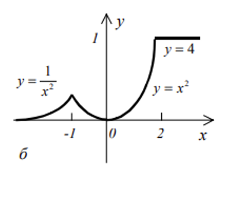

# Задание 1

> Дано действительное число a. Не пользуясь никакими другими операциями, кроме умножения, получить a2, a5, a17 за шесть операций.

```pascal
program FindOverflowN;

begin
  var a, aTemp: Real;
  a := ReadReal('Введите a:');
  aTemp := a;
  
  a *= a;
  writeln('a^2: ', a);
  
  a *= a;
  writeln('a^5: ', a * aTemp);
  
  a *= a;
  a *= a * aTemp;
  writeln('a^17: ', a);
end.
```

# Задание 2

> Найти площадь сектора, радиус которого равен 13,7, а дуга содержит заданное число радиан. Составьте программу, которая запрашивает ввод данных с клавиатуры. Ответ округлите до двух знаков после запятой.

```pascal
program SectorArea;

var
  r, phi, area: real;

begin
  writeln('Введите радиус круга (r): ');
  readln(r);
  
  writeln('Введите угол дуги в радианах (φ): ');
  readln(phi);
  
  area := 0.5 * r * r * phi;
  
  writeln('Площадь сектора: ', area:0:2);
end.

```

# Задание 3

> Даны действительные числа $x,y,z$. Вычислить max ($x+y+z$, $xyz$). Составить программу двумя способами: без использования функции max и  использованием функции max.

```pascal
program MaxWithoutFunction;

var
  x, y, z, sum, product, myResult: real;
  
begin
  writeln('Введите три действительных числа:');
  readln(x, y, z);

  sum := x + y + z;
  product := x * y * z;

  if sum > product then
    myResult := sum
  else
    myResult := product;

  writeln('Максимальное значение (without max): ', myResult:0:2);
  writeln('Максимальное значение (with max): ', Max(sum, product):0:2);
end.
```

# Задание 4

> Дано действительное число a. Для функций, графики которых представлены на рисунках, вычислить f(a).
>
> 
```pascal
program Graph;

var a, y: real;

begin
  a := readReal('Введите число a: ');

  if a <= -1 then
    y := 1 / sqr(a)
  else if (a > -1.0) and (a <= 2) then
    y := sqr(a)
  else 
    y := 4;

  writeln('y = ', y);
end.
```

# Задание 5a

> Даны действительные числа х, у. Определить, принадлежит ли точка  c координатами х,у заштрихованной части плоскости. 
>
> 

```pascal
program PointInCircle;
var
  x, y: real;
  inRegion: boolean;
begin
  write('Введите координаты точки (x, y): ');
  readln(x, y);
  
  inRegion := (x*x + y*y) <= 4;
  
  if inRegion then
    writeln('Точка принадлежит заштрихованной области')
  else
    writeln('Точка НЕ принадлежит заштрихованной области');
end.
```

# Задание 5b

> Даны действительные числа х, у. Определить, принадлежит ли точка  c координатами х,у заштрихованной части плоскости. 
>
> 

```pascal
program PointInRectangle;
var
  x, y: real;
  inRegion: boolean;
begin
  write('Введите координаты точки (x, y): ');
  readln(x, y);
  
  // Предположим, что заштрихован прямоугольник от -2 до 2 по x и от -1 до 1 по y
  inRegion := (x >= -2) and (x <= 2) and (y >= -1) and (y <= 1);
  
  if inRegion then
    writeln('Точка принадлежит заштрихованной области')
  else
    writeln('Точка НЕ принадлежит заштрихованной области');
end.
```
